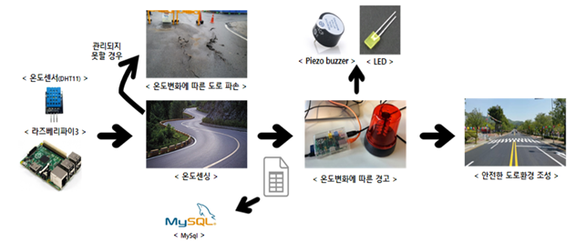
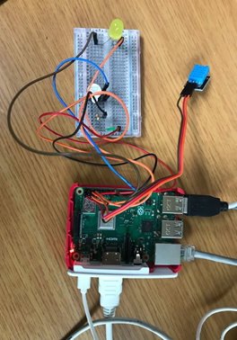
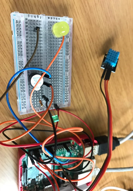
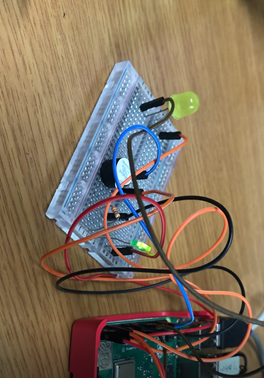
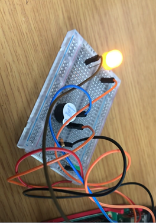
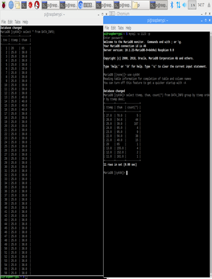
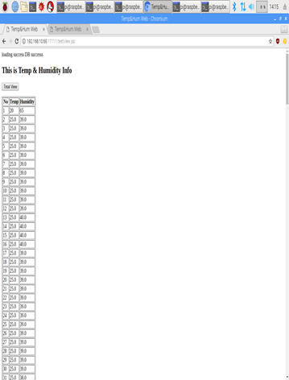

## 온도센싱을 통한 안전한 도로관리 서비스

**1. 프로젝트 개요**
  - 올해 여름의 평균온도가 39도까지 올라가며 국내 최고 기록을 달성했다. 이처럼 더운 날씨 때문에 포장된 지반의 온도 또한 상승했고, 사람과 동물은 물론 길 위의 물체까지도 고온으로 인한 피해가 발생하고 있다. 더운 계절뿐만 아니라 최근의 한파로 땅이 얼어 '블랙아이스'로 인한 차량이 전복사고도 있었다.
  - 대한민국은 점차 열대성 기후로 변해가고 있다. 온도의 극심한 차이가 아스팔트를 부식시키고, 솟아오르는 등의 다양한 피해가 발생하고있다.
  - 이러한 문제들을 예방할 수 있도록 도로의 온도의 측정하고 수집된 대량의 데이터를 기반으로 데이터를 분석할 수 있는 서비스를 개발하고자 한다.

**2. 프로젝트 기능 목표**
  - 온도 센서(DHT-11)를 통해 온도데이터 수집 후 데이터베이스에 저장
  - 데이터베이스에 저장된 데이터에 접근, 비교하여 조건에 만족하면 LED센서와 부저센서 동작하게 함

**3. 프로젝트 구성도**  

**4. 아이디어 세부 기능**
  - 제품의 주요 기능적/비기능적 요구사항 작성
    - 온도센서를 이용하여 도로 온도 수집
    - 라즈베리파이 데이터베이스에 수집된 온도 저장
    - 온도 변화시 수집된 온도와 비교하여 LED, 부저 센서 작동
    - Web을 통해 데이터베이스에 저장된 데이터 확인 가능

  - 사용 시나리오 (사용 방법이나 순서) 소개
    - 온도센서를 통한 온도 센싱을 통해 수집된 온도를 데이터베이스에 저장하고, 저장된 데이터를 가져와 비교하여 LED, 부저 센서를 작동하게 하여 문제 발생을 알릴 수 있도록 프로그래밍을 함. Web을 통해 수집된 데이터 확인도 가능하다.

**4. 주요 기능**
  - 온도 센서 제어
    - GitHub 라이브러리 이용
  - LED 센서 제어
  - Buzzer 센서 제어
  - 데이터 저장
    - Mysql 활용
  - 인터페이스 제공(Web)
    - Jsp 활용
    - 수집 데이터 확인

**5. 개발 도구**
  - Python3
  - APM 환경 이용
  - Raspberry Pi 3 Model
  - LED센서
  - 온도센서(DHT-11)
  - 부저센서(Piezo Buzzer)

**6. 구현 결과**
  - 연결모형 
 

  - 온도별(저온, 고온) LED, Buzzer 결과 

  - UI 구성(web)
    - 차례로 Mysql, web_ListView, web_TotalView 

**7. 역할 분담**
  - 최용권 등 2명
  | 순번     | 기능 항목     | 예상 결과 | 개발자 |
  | :------------- | :------------- |||
  | 1       | 라즈베리파이 환경 구성 | APM 및 라즈베리파이 기본 환경 구성 | 최용권 |
  | 2       | 온도 센서 출력 | 온도별 온도 센서 제어 (Python3) | 최용권 |
  | 3       | LED 센서 출력 | 온도별 LED 센서 작동 | 최용권 |
  | 4       | 부저 센서 출력 | 온도별 Buzzer 센서 작동 | 최용권 |
  | 5       | Web 제작 | JSP를 통한 웹 구현, 데이터 수집 내용 확인 | 최용권 |
  | 6       | MySql, Tomcat8 연동 | MySql, Tomcat8(Server) 구축 및 이용 | 최용권 등 2명 |
  | 7       | 프로그램 테스트 | 프로그램 작동 확인 | 최용권 등 2명 |
